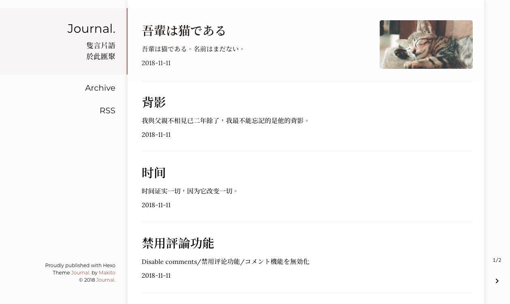
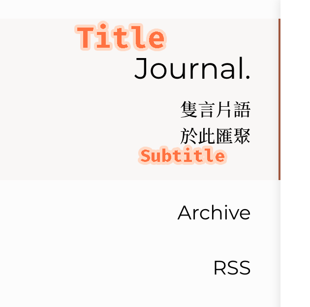

Journal.
======
隻言片語・於此匯聚

Moments piled up.

[Changelog](CHANGELOG.md)



### Features

- Simple and easy to customize
- Concentrated on reading <del>and writing (find a Markdown editor then)</del> experience
- Mobile-friendly & widescreen-friendly
- Flexible commenting control

### Installation

First, `cd` into your Hexo root directory.

#### Installing dependencies

```bash
yarn add hexo-renderer-ejs hexo-generator-archive hexo-generator-category-enhance hexo-generator-feed hexo-generator-index hexo-generator-tag
# or `npm i --save hexo-renderer-ejs hexo-generator-archive hexo-generator-category-enhance hexo-generator-feed hexo-generator-index hexo-generator-tag` for npm users
```

#### Cloning the theme

```bash
cd themes
git clone https://github.com/SumiMakito/hexo-theme-Journal.git journal
cd journal
yarn install # or `npm i` for npm users
```

#### Applying the theme

Find the _config.yml file at your Hexo root directory and apply the theme.

```yaml
theme: journal
```

### User Guide

#### Post items and pages


<div align="center"><small>↑ An example of a post item ↑</small></div>

Generally speaking, a post file in source/_posts or a page file always begins with a header in the following format.

```yaml
---
title: 吾輩は猫である
intro: 吾輩は猫である。名前はまだない。
featured_image: neko.jpg
date: 2018-11-11 12:00:00
tags: 
    - Novel
    - Japanese
---
```

Maybe you've already noticed that there're two new fields named `intro` and `featured_image`. These two **optional** fields are used to optimize post items' appearance. 

##### Intro

If `intro` is set, the value will be used as abstract instead of the automatically truncated one. Also, by editing the *_config.yml* in theme _Journal._'s directory, you are able to control the truncation length for all articles.

```yaml
...
truncate_len: 60
...
```

##### Featured image

If `featured_image` presents, the image specified will show up in the post item, also, the feature image will show up in the detailed post's or page's page. In this example, the `neko.jpg` is placed in the asset folder for the post or page.

**New in 2.0.3:** `featured_image` can now be an URL starts with `http://` or `https://`.

#### Title and subtitle

The title area of the theme Journal. consists two parts — the title and the subtitle.

<div align="center"></div>

<div align="center"><small>↑ An example of the title area ↑</small></div>

Edit the *_config.yml* **in theme _Journal._'s directory**:

```yaml
sidebar_title: "Journal."
sidebar_subtitle: "隻言片語<br>於此匯聚"
```

> In `sidebar_title` and `sidebar_subtitle`, HTML is supported as the example above demonstrated.

#### Archives

By default, the 'Archives' entry will not appear in the navigation section. To show the 'Archives' in the navigation section, you will need to enable the archives explicitly in the theme-level *_config.yml*.

```yaml
archives: true
```

> The generation of archives will be done by `hexo-generator-archive`. So please ensure that it has been added as a dependency in your package.json.

#### RSS

By adding the following line to the *_config.yml* in theme _Journal._'s directory, an RSS entry will show up in the navigation drawer which points to the location specified.

```yaml
rss: atom
```

> The plugin `hexo-generator-feed` is usually required for this function.

#### Commenting

The theme *Journal.* natively supports two commenting services – [Livere](https://www.livere.com/) and [Disqus](https://disqus.com/). To enable commenting, you just need to add **one of** the following lines to the *_config.yml* **in theme _Journal._'s directory**.

```yaml
livere: [data-uid] on livere.com
disqus: [short_name] on disqus.com
```

> If two fields are **both left non-empty**, two comment boxes will appear. To fix this, just leave one of the two fields empty.

#### Disabling commenting

You are free to choose whether or not to disable commenting on some posts or pages at all times as you like it since you're the owner.

You can disable commenting just by adding one line of code in the header of a post or page file.

```yaml
---
...
no_comments: true
...
---
```

#### Page entries

When a page is created, its entry will automatically show up in the global navigation drawer on the left side of the screen.

#### Syntax highlighting

The theme *Journal.* natively supports syntax highlighting. However, the plugin `hexo-prism-plugin` is required. You can install it by running `yarn add hexo-prism-plugin` or `npm i --save hexo-prism-plugin` **at your Hexo root directory**.

#### Table of contents

With the plugin `hexo-toc`, the theme *Journal.* natively supports showing the table of contents in an article. You can install it by running `yarn add hexo-toc` or `npm i --save hexo-toc` **at your Hexo root directory**.

Then, you can insert `<!-- toc -->` after the header of the post file to enable table of contents.

### Support the developer

If you find my work awesome and useful, please consider donating. It is your support that helps me to do better!

[PayPal.me/Makito](https://www.paypal.me/makito)

